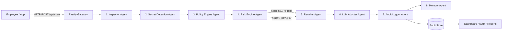
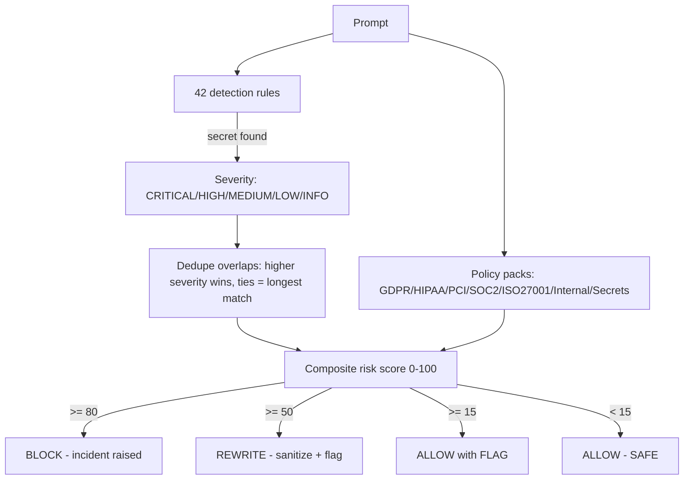
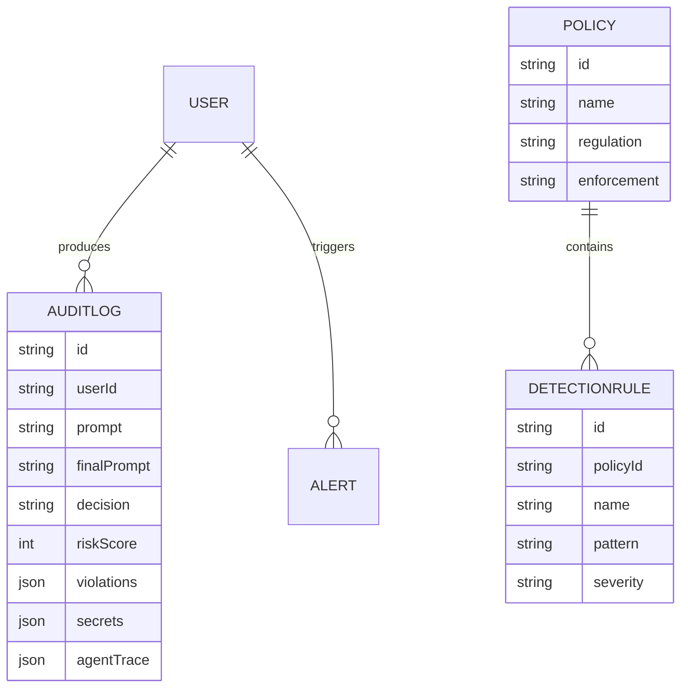

# SentinelX — System Architecture

## Request flow

## Decision engine

## Data layer

## Deployment modes

- **Demo (default)**: no external services. `src/lib/store.ts` detects Postgres availability and falls back to an in-memory store, seeded on boot. Redis cache disabled.
- **Enterprise**: set `DATABASE_URL` + `REDIS_URL` in `apps/api/.env`; Prisma migrations apply, caching and dedupe enable automatically.
