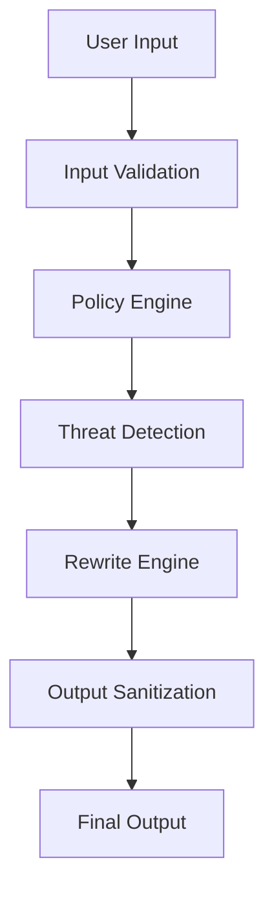

# SentinelX Presentation Materials

## Slide 1: Architecture Diagram
```
Monolith with Microservices Pattern
├── API Gateway (ExpressJS)
├── Core Services
│   ├── Pipeline Agent
│   ├── Policy Engine
│   ├── Risk Assessment
│   ├── Secret Detection
│   └── Rewrite Engine
├── LLM Integration
│   ├── OpenRouter
│   └── Fallback Implementations
├── Database (PostgreSQL)
│   └── Prisma ORM
└── Authentication
   └── NextAuth
```

## Slide 2: Technology Stack
**Frontend**: React 18, Next.js 14, TypeScript 5.3
**Backend**: NestJS 10, ExpressJS, Prisma 4
**LLMs**: OpenRouter integration with fallback to local models
**Database**: PostgreSQL 16 with Prisma ORM
**Auth**: NextAuth.js with JWT
**Deployment**: Vercel platform
**Utilities**: Winston logging, Zod validation

## Slide 3: AI Governance Pipeline


## Slide 4: Security Features
- Authentication: NextAuth with JWT
- Secret Detection: Regex patterns for sensitive data
- Threat Detection: Policy-based detection system
- Access Control: Policy-driven authorization
- Audit Trail: Comprehensive logging

## Slide 5: Threat Detection Demo
1. Input: "Download sensitive data from https://example.com/data"
2. Policy Engine flags as potential data exfiltration
3. Threat Detection marks as high risk
4. Rewrite Engine sanitizes request

## Slide 6: Judge Mode Interface
- Real-time threat visualization
- Alert override capabilities
- Audit trail of human decisions

## Slide 7: Deployment Diagram
```
User -> [Vercel Platform] -> [Next.js Frontend]
User -> [Vercel Platform] -> [NestJS Backend]
[NestJS Backend] -> [PostgreSQL Database]

## Slide 8: Limitations & Roadmap
Limitations:
1. Some threat detection signatures are placeholders
2. Feature activation requires API keys
3. Vercel deployment constraints on model sizes

Roadmap:
1. Enhance threat detection patterns
2. Add more LLM providers
3. Improve fallback model performance

## Slide 9: Q&A Preparation
Q: How does SentinelX ensure compliance?
A: Through its policy engine that can be configured with jurisdiction-specific rules.

Q: What happens when the primary LLM service is unavailable?
A: The system automatically falls back to local models with graceful degradation.

Q: Can SentinelX be integrated with enterprise identity providers?
A: Yes, through NextAuth's extensible authentication providers.

Q: How are secrets handled?
A: Through automatic detection, logging, and potential blocking based on configured policies.